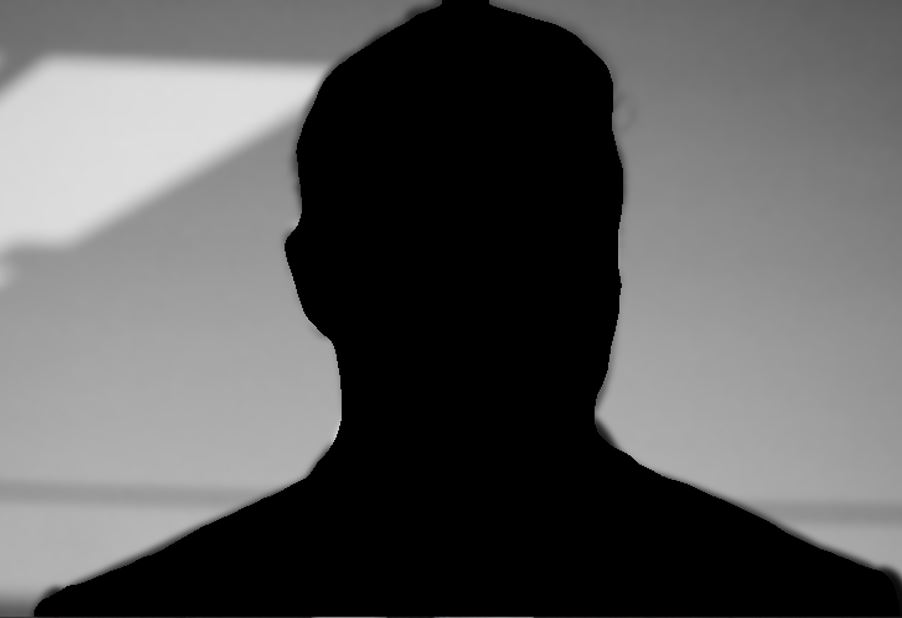

# Background blur using DeepLab Model

Model gives segmented map and from this model we get foreground using bitwiseAND operation
Edge detection is also improve using Erosion Morphological operation 
### Input image

### Foreground without erosion 
forground without erosion 

### Forground Image using erosion

### Background
Background is extracted using AND operation with blur original image and inverse map 

 
Lastly adding both layers gives blur background image                            I
  
